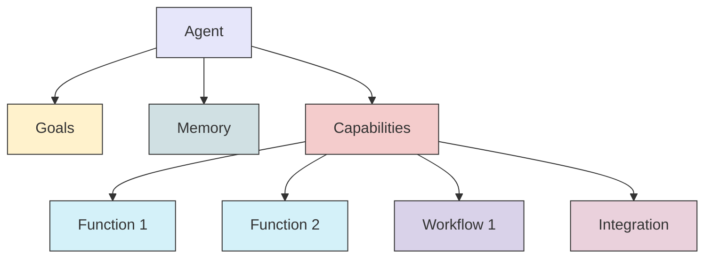

# AI Primitives Platform Architecture

This document provides an overview of the AI Primitives platform architecture, explaining the major components, their relationships, and how they work together to deliver economically valuable work through simple APIs.

## System Overview

The AI Primitives platform is a comprehensive framework for building enterprise-grade AI applications. It provides composable building blocks that enable developers to create, deploy, and manage AI functions, workflows, and autonomous agents.

## Core Primitives

### Functions.do - Inputs to Structured Outputs

Functions.do provides strongly-typed composable building blocks for AI applications. These functions take inputs and produce structured outputs, making them easy to compose into more complex workflows.

Key characteristics:

- Strongly-typed inputs and outputs
- Support for various output schemas
- Cached responses for improved performance
- Detailed generation tracking for observability

### Workflows.do - Business-as-Code

Workflows.do provides declarative state machines for orchestrating functions and other components. Workflows enable complex business processes to be defined and executed reliably.

Key characteristics:

- Event-driven execution
- State management
- Error handling and retries
- Integration with external systems

### Agents.do - Autonomous Digital Workers

Agents.do combines functions and workflows to create autonomous digital workers that can perform complex tasks with minimal human intervention.

Key characteristics:

- Goal-oriented behavior
- Memory and context management
- Access to functions, workflows, and integrations
- Autonomous decision making

## Event System

### Triggers.do - Start Business Processes

Triggers.do enables workflows to be initiated based on events from various sources, such as API calls, webhooks, or scheduled tasks.

### Searches.do - Provide Context & Understanding

Searches.do provides query capabilities for retrieving data from various sources, providing context and understanding for workflows and agents.

### Actions.do - Impact the External World

Actions.do enables workflows and agents to perform tasks that impact the external world, such as sending emails, creating issues, or updating records.

## Foundation Components

### LLM.do - Intelligent AI Gateway

LLM.do serves as an intelligent gateway for routing AI requests to the optimal language models based on capabilities and requirements.

Key capabilities:

- Model selection based on capabilities
- Load balancing and fallbacks
- Integrated function and integration calling
- Observability and analytics

### Database.do - AI-enriched Data

Database.do provides persistent data storage with AI-enriched capabilities, built on Payload CMS.

### Evals.do - Measure & Improve

Evals.do provides evaluation tools for AI components, enabling continuous improvement and quality assurance.

### Integrations.do - Connect External Systems

Integrations.do provides connectors for external systems, enabling seamless integration with third-party services.

## API Gateway

### APIs.do - Clickable Developer Experiences

APIs.do provides a unified gateway for accessing all platform services through simple, clickable APIs.

## Data Flow Architecture

The following diagram illustrates the high-level data flow in the AI Primitives platform:

## Deployment Architecture

The AI Primitives platform leverages modern deployment paradigms for scalability and reliability:

## Repository Structure

The AI Primitives platform is organized as a monorepo using Turborepo with pnpm workspaces:

```mermaid
graph TD
    Root["/"] --> App["app/"]
    Root --> Collections["collections/"]
    Root --> Components["components/"]
    Root --> Content["content/"]
    Root --> Lib["lib/"]
    Root --> Packages["pkgs/"]
    Root --> SDKs["sdks/"]
    Root --> Tasks["tasks/"]
    Root --> Websites["websites/"]
    Root --> Workers["workers/"]
    Root --> Workflows["workflows/"]

    App --> WebsitesApp["app/(websites)/"]
    App --> APIsApp["app/(apis)/"]
    App --> PayloadApp["app/(payload)/"]

    Collections --> AICollections["collections/ai/"]
    Collections --> DataCollections["collections/data/"]
    Collections --> EventsCollections["collections/events/"]
    Collections --> ObservabilityCollections["collections/observability/"]

    Packages --> AIModels["pkgs/ai-models/"]
    Packages --> DeployWorker["pkgs/deploy-worker/"]
    Packages --> ClickableLinks["pkgs/clickable-links/"]

    SDKs --> FunctionsSDK["sdks/functions/"]
    SDKs --> WorkflowsSDK["sdks/workflows/"]
    SDKs --> AgentsSDK["sdks/agents/"]
    SDKs --> DatabaseSDK["sdks/database/"]

    style Root fill:#f9f9f9,stroke:#333,stroke-width:1px
    style App fill:#d5a6bd,stroke:#333,stroke-width:1px
    style Collections fill:#d0e0e3,stroke:#333,stroke-width:1px
    style Components fill:#c9daf8,stroke:#333,stroke-width:1px
    style Content fill:#d9ead3,stroke:#333,stroke-width:1px
    style Lib fill:#d9d2e9,stroke:#333,stroke-width:1px
    style Packages fill:#ffd966,stroke:#333,stroke-width:1px
    style SDKs fill:#d4f1f9,stroke:#333,stroke-width:1px
    style Tasks fill:#ead1dc,stroke:#333,stroke-width:1px
    style Websites fill:#cfe2f3,stroke:#333,stroke-width:1px
    style Workers fill:#ead1dc,stroke:#333,stroke-width:1px
    style Workflows fill:#d4f1f9,stroke:#333,stroke-width:1px
```

Key directories:

- `/app/`: Next.js application components
- `/collections/`: Payload CMS collection definitions
- `/components/`: Shared UI components
- `/content/`: MDX content files
- `/lib/`: Shared utility functions
- `/pkgs/`: Shared packages (monorepo)
- `/sdks/`: Zero-dependency SDK implementations published to npm
- `/tasks/`: Backend implementations with dependencies
- `/websites/`: Website implementations
- `/workers/`: Cloudflare Workers implementations
- `/workflows/`: Workflow definitions and examples

## Collection Structure

The AI Primitives platform uses Payload CMS collections to define data models and their relationships:

```mermaid
graph TD
    subgraph "Core AI Collections"
        Functions["Functions<br/>AI function definitions"]
        Workflows["Workflows<br/>Orchestration definitions"]
        Agents["Agents<br/>Autonomous workers"]
    end

    subgraph "Event Collections"
        Triggers["Triggers<br/>Event initiators"]
        Actions["Actions<br/>External impact"]
        Searches["Searches<br/>Data retrieval"]
    end

    subgraph "Data Collections"
        Resources["Resources<br/>Core entities"]
        Nouns["Nouns<br/>Entity categories"]
        Verbs["Verbs<br/>Action types"]
    end

    subgraph "Integration Collections"
        Integrations["Integrations<br/>External systems"]
        IntegrationActions["IntegrationActions<br/>External operations"]
        IntegrationTriggers["IntegrationTriggers<br/>External events"]
        Connections["Connections<br/>Integration auth"]
        IntegrationCategories["IntegrationCategories<br/>Grouping"]
    end

    subgraph "Evaluation Collections"
        Evals["Evals<br/>Evaluation definitions"]
        EvalsRuns["EvalsRuns<br/>Evaluation executions"]
        EvalsResults["EvalsResults<br/>Evaluation outcomes"]
        Benchmarks["Benchmarks<br/>Performance metrics"]
        Datasets["Datasets<br/>Test data"]
    end

    subgraph "Observability Collections"
        Generations["Generations<br/>AI responses"]
        Events["Events<br/>System events"]
        Errors["Errors<br/>Error records"]
        Traces["Traces<br/>Execution paths"]
    end

    subgraph "Code Collections"
        Packages["Packages<br/>Code packages"]
        Modules["Modules<br/>Code modules"]
        Types["Types<br/>Type definitions"]
        Deployments["Deployments<br/>Deployment records"]
    end

    subgraph "Admin Collections"
        Users["Users<br/>User accounts"]
        Roles["Roles<br/>Access control"]
        Projects["Projects<br/>Project containers"]
        APIKeys["APIKeys<br/>Authentication"]
        Tags["Tags<br/>Content organization"]
        Webhooks["Webhooks<br/>External notifications"]
    end

    subgraph "Job Collections"
        Tasks["Tasks<br/>Background jobs"]
        Queues["Queues<br/>Job queues"]
    end

    subgraph "Experiment Collections"
        Experiments["Experiments<br/>Test configurations"]
        Models["Models<br/>AI model definitions"]
        Prompts["Prompts<br/>Prompt templates"]
        Settings["Settings<br/>Configuration"]
    end

    style Functions fill:#d4f1f9,stroke:#333,stroke-width:1px
    style Workflows fill:#d9d2e9,stroke:#333,stroke-width:1px
    style Agents fill:#e6e6fa,stroke:#333,stroke-width:1px
    style Triggers fill:#ffd966,stroke:#333,stroke-width:1px
    style Actions fill:#ead1dc,stroke:#333,stroke-width:1px
    style Searches fill:#d9ead3,stroke:#333,stroke-width:1px
    style Resources fill:#f9f9f9,stroke:#333,stroke-width:1px
    style Nouns fill:#f9f9f9,stroke:#333,stroke-width:1px
    style Verbs fill:#f9f9f9,stroke:#333,stroke-width:1px
    style Integrations fill:#ead1dc,stroke:#333,stroke-width:1px
    style IntegrationActions fill:#ead1dc,stroke:#333,stroke-width:1px
    style IntegrationTriggers fill:#ead1dc,stroke:#333,stroke-width:1px
    style Connections fill:#ead1dc,stroke:#333,stroke-width:1px
    style IntegrationCategories fill:#ead1dc,stroke:#333,stroke-width:1px
    style Evals fill:#fff2cc,stroke:#333,stroke-width:1px
    style EvalsRuns fill:#fff2cc,stroke:#333,stroke-width:1px
    style EvalsResults fill:#fff2cc,stroke:#333,stroke-width:1px
    style Benchmarks fill:#fff2cc,stroke:#333,stroke-width:1px
    style Datasets fill:#fff2cc,stroke:#333,stroke-width:1px
    style Generations fill:#d0e0e3,stroke:#333,stroke-width:1px
    style Events fill:#d0e0e3,stroke:#333,stroke-width:1px
    style Errors fill:#d0e0e3,stroke:#333,stroke-width:1px
    style Traces fill:#d0e0e3,stroke:#333,stroke-width:1px
    style Packages fill:#c9daf8,stroke:#333,stroke-width:1px
    style Modules fill:#c9daf8,stroke:#333,stroke-width:1px
    style Types fill:#c9daf8,stroke:#333,stroke-width:1px
    style Deployments fill:#c9daf8,stroke:#333,stroke-width:1px
    style Users fill:#d5a6bd,stroke:#333,stroke-width:1px
    style Roles fill:#d5a6bd,stroke:#333,stroke-width:1px
    style Projects fill:#d5a6bd,stroke:#333,stroke-width:1px
    style APIKeys fill:#d5a6bd,stroke:#333,stroke-width:1px
    style Tags fill:#d5a6bd,stroke:#333,stroke-width:1px
    style Webhooks fill:#d5a6bd,stroke:#333,stroke-width:1px
    style Tasks fill:#f4cccc,stroke:#333,stroke-width:1px
    style Queues fill:#f4cccc,stroke:#333,stroke-width:1px
    style Experiments fill:#cfe2f3,stroke:#333,stroke-width:1px
    style Models fill:#cfe2f3,stroke:#333,stroke-width:1px
    style Prompts fill:#cfe2f3,stroke:#333,stroke-width:1px
    style Settings fill:#cfe2f3,stroke:#333,stroke-width:1px
```

### Collection Relationships

The following diagram illustrates the key relationships between collections:

```mermaid
graph TD
    Functions --> Prompts
    Functions --> Agents
    Functions --> Actions

    Workflows --> Functions
    Workflows --> Modules
    Workflows --> Packages
    Workflows --> Deployments

    Actions --> Resources["Resources (subject)"]
    Actions --> Verbs
    Actions --> Functions
    Actions --> Resources2["Resources (object)"]
    Actions --> Generations

    Triggers --> Workflows
    Searches --> Workflows

    Integrations --> IntegrationCategories
    IntegrationActions --> Integrations
    IntegrationTriggers --> Integrations
    Connections --> Integrations

    Evals --> EvalsRuns
    EvalsRuns --> EvalsResults
    EvalsRuns --> Datasets
    EvalsResults --> Benchmarks

    Tasks --> Queues

    Experiments --> Models
    Experiments --> Prompts
    Experiments --> Settings

    style Functions fill:#d4f1f9,stroke:#333,stroke-width:1px
    style Workflows fill:#d9d2e9,stroke:#333,stroke-width:1px
    style Agents fill:#e6e6fa,stroke:#333,stroke-width:1px
    style Triggers fill:#ffd966,stroke:#333,stroke-width:1px
    style Actions fill:#ead1dc,stroke:#333,stroke-width:1px
    style Searches fill:#d9ead3,stroke:#333,stroke-width:1px
    style Resources fill:#f9f9f9,stroke:#333,stroke-width:1px
    style Resources2 fill:#f9f9f9,stroke:#333,stroke-width:1px
    style Verbs fill:#f9f9f9,stroke:#333,stroke-width:1px
    style Integrations fill:#ead1dc,stroke:#333,stroke-width:1px
    style IntegrationActions fill:#ead1dc,stroke:#333,stroke-width:1px
    style IntegrationTriggers fill:#ead1dc,stroke:#333,stroke-width:1px
    style Connections fill:#ead1dc,stroke:#333,stroke-width:1px
    style IntegrationCategories fill:#ead1dc,stroke:#333,stroke-width:1px
    style Evals fill:#fff2cc,stroke:#333,stroke-width:1px
    style EvalsRuns fill:#fff2cc,stroke:#333,stroke-width:1px
    style EvalsResults fill:#fff2cc,stroke:#333,stroke-width:1px
    style Benchmarks fill:#fff2cc,stroke:#333,stroke-width:1px
    style Datasets fill:#fff2cc,stroke:#333,stroke-width:1px
    style Generations fill:#d0e0e3,stroke:#333,stroke-width:1px
    style Modules fill:#c9daf8,stroke:#333,stroke-width:1px
    style Packages fill:#c9daf8,stroke:#333,stroke-width:1px
    style Deployments fill:#c9daf8,stroke:#333,stroke-width:1px
    style Tasks fill:#f4cccc,stroke:#333,stroke-width:1px
    style Queues fill:#f4cccc,stroke:#333,stroke-width:1px
    style Experiments fill:#cfe2f3,stroke:#333,stroke-width:1px
    style Models fill:#cfe2f3,stroke:#333,stroke-width:1px
    style Prompts fill:#cfe2f3,stroke:#333,stroke-width:1px
    style Settings fill:#cfe2f3,stroke:#333,stroke-width:1px
```

