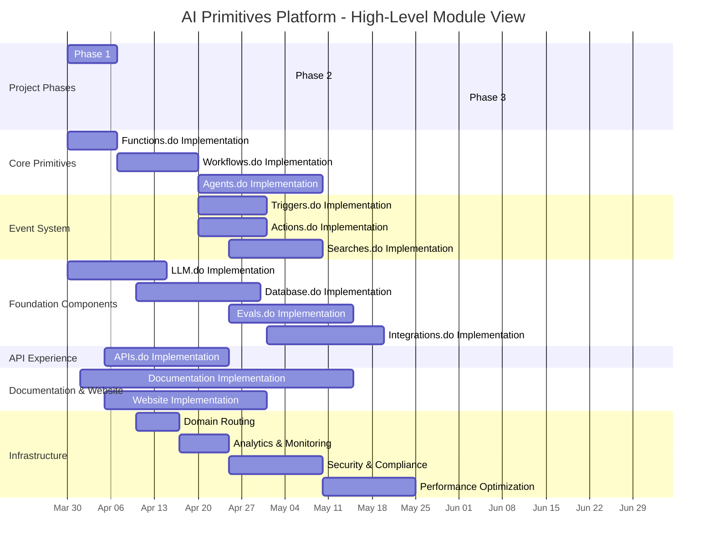

# AI Primitives Platform Project Plan

This document outlines the project plan for the AI Primitives platform, organized as Gantt charts with task dependencies and resource allocation recommendations. The plan is based on the tickets in the backlog and follows the phased implementation approach outlined in the roadmap.

## High-Level Module Gantt Chart

## Resource Allocation Strategy

As a project manager, I would recommend the following resource allocation strategy for implementing the AI Primitives platform:

### Team Structure

1. **Core Platform Team**
   - Focus: Functions.do, LLM.do, APIs.do
   - Skills: TypeScript, API design, AI model integration
   - Priority: Phase 1 implementation

2. **Event System Team**
   - Focus: Workflows.do, Triggers.do, Actions.do, Searches.do
   - Skills: Event-driven architecture, state machines, TypeScript
   - Priority: Phase 2 implementation

3. **Agent & Integration Team**
   - Focus: Agents.do, Integrations.do, Database.do
   - Skills: Autonomous systems, API integrations, database design
   - Priority: Phase 2-3 implementation

4. **Documentation & DevOps Team**
   - Focus: Documentation, website, infrastructure, testing
   - Skills: Technical writing, frontend development, DevOps
   - Priority: Continuous throughout all phases

### Implementation Sequence

1. **Start with Core Foundation (Phase 1)**
   - Begin with Functions.do and LLM.do in parallel
   - Follow with APIs.do implementation
   - Establish basic documentation structure early

2. **Build Event System (Phase 2)**
   - Implement Workflows.do building on Functions.do
   - Develop Triggers.do and Actions.do in parallel
   - Add Searches.do capabilities

3. **Expand to Advanced Features (Phase 3)**
   - Implement Agents.do leveraging Functions.do and Workflows.do
   - Enhance Integrations.do capabilities
   - Develop Evals.do framework

4. **Optimize and Scale (Phase 4)**
   - Implement analytics integration
   - Optimize performance
   - Extend model support
   - Add enterprise features

### Critical Path Management

The critical path for this project runs through:
1. Functions.do implementation (core foundation)
2. Workflows.do implementation (building on Functions.do)
3. Event System integration (Triggers, Actions, Searches)
4. Agents.do implementation (leveraging all previous components)

To ensure timely delivery, the project manager should:
1. Allocate additional resources to critical path tasks
2. Monitor progress closely on these components
3. Address blockers immediately
4. Consider parallel implementation where dependencies allow

### Risk Mitigation

1. **Technical Risks**
   - Begin with proof-of-concepts for complex components
   - Implement comprehensive testing early
   - Establish clear API contracts between components

2. **Resource Risks**
   - Cross-train team members on adjacent components
   - Document architecture decisions and implementation details
   - Create reusable patterns and libraries

3. **Timeline Risks**
   - Focus on MVP functionality first
   - Implement feature flags for gradual rollout
   - Establish clear prioritization criteria

## Detailed Task-Level Gantt Chart

```mermaid
gantt
    title AI Primitives Platform - Detailed Task View
    dateFormat  YYYY-MM-DD
    axisFormat  %b %d
    todayMarker off
    
    section Core Primitives - Functions.do
    Define types.ts for SDK                   :func1, 2025-03-30, 4d
    Define initial API for SDK                :func2, after func1, 3d
    Write README with usage examples          :func3, after func2, 2d
    Develop unit tests for SDK                :func4, after func2, 4d
    Develop SDK implementation                :func5, after func2, 5d
    Develop e2e tests for SDK & API           :func6, after func5, 4d
    Develop API implementation                :func7, after func5, 5d
    Develop clickable API                     :func8, after func7, 3d
    Support structured outputs                :func9, after func8, 4d
    Support saved schemas & prompts           :func10, after func9, 3d
    Handle cached responses/actions           :func11, after func10, 3d
    
    section Core Primitives - Workflows.do
    Define types.ts for SDK                   :wf1, 2025-04-07, 4d
    Define initial API for SDK                :wf2, after wf1, 3d
    Write README with usage examples          :wf3, after wf2, 2d
    Develop unit tests for SDK                :wf4, after wf2, 4d
    Develop SDK implementation                :wf5, after wf2, 5d
    Develop e2e tests for SDK & API           :wf6, after wf5, 4d
    Develop API implementation                :wf7, after wf5, 5d
    Develop clickable API                     :wf8, after wf7, 3d
    Figure out Task/Workflow handling         :wf9, after wf8, 4d
    Revisit executeFunction design            :wf10, after wf9, 3d
    
    section Core Primitives - Agents.do
    Define initial API for SDK                :agent1, 2025-04-15, 3d
    Write README with usage examples          :agent2, after agent1, 2d
    Define types.ts for SDK                   :agent3, after agent1, 4d
    Implement package.json                    :agent4, after agent1, 2d
    Develop unit tests for SDK                :agent5, after agent3, 4d
    Develop SDK implementation                :agent6, after agent3, 5d
    Develop e2e tests for SDK & API           :agent7, after agent6, 4d
    Develop API implementation                :agent8, after agent6, 5d
    Develop clickable API                     :agent9, after agent8, 3d
    Prevent duplicate agents                  :agent10, after agent9, 2d
    
    section Event System - Triggers.do
    Configure action collection               :trig1, 2025-04-20, 3d
    Expose possible triggers                  :trig2, after trig1, 3d
    Ingest integration triggers               :trig3, after trig2, 4d
    Expose clickable API of triggers          :trig4, after trig3, 3d
    
    section Event System - Actions.do
    Configure action collection               :act1, 2025-04-20, 3d
    Expose possible actions                   :act2, after act1, 3d
    Ingest integration actions                :act3, after act2, 4d
    Expose clickable API of actions           :act4, after act3, 3d
    
    section Event System - Searches.do
    Define search capabilities                :search1, 2025-04-25, 5d
    Implement search functionality            :search2, after search1, 7d
    
    section Foundation Components - LLM.do
    Router with Model Name Selection          :llm1, 2025-03-30, 5d
    AI providers package implementation       :llm2, after llm1, 6d
    Clickable experience with GET             :llm3, after llm2, 3d
    Integrated tool use                       :llm4, after llm3, 5d
    SDK implementation                        :llm5, after llm4, 7d
    
    section Foundation Components - Database.do
    Define initial API for SDK                :db1, 2025-04-10, 3d
    Write README with usage examples          :db2, after db1, 2d
    Define types.ts for SDK                   :db3, after db1, 4d
    Implement package.json                    :db4, after db1, 2d
    Develop unit tests for SDK                :db5, after db3, 4d
    Develop SDK implementation                :db6, after db3, 5d
    Develop e2e tests for SDK & API           :db7, after db6, 4d
    Develop API implementation                :db8, after db6, 5d
    Develop clickable API                     :db9, after db8, 3d
    Extract simple db interface               :db10, after db9, 4d
    
    section Foundation Components - Evals.do
    Define initial API for SDK                :eval1, 2025-04-25, 3d
    Write README with usage examples          :eval2, after eval1, 2d
    Define types.ts for SDK                   :eval3, after eval1, 4d
    Implement package.json                    :eval4, after eval1, 2d
    Develop unit tests for SDK                :eval5, after eval3, 4d
    Develop SDK implementation                :eval6, after eval3, 5d
    Develop e2e tests for SDK & API           :eval7, after eval6, 4d
    Develop API implementation                :eval8, after eval6, 5d
    Develop clickable API                     :eval9, after eval8, 3d
    Define evaluation framework               :eval10, after eval9, 5d
    
    section Foundation Components - Integrations.do
    Define initial API for SDK                :int1, 2025-05-01, 3d
    Write README with usage examples          :int2, after int1, 2d
    Define types.ts for SDK                   :int3, after int1, 4d
    Implement package.json                    :int4, after int1, 2d
    Develop unit tests for SDK                :int5, after int3, 4d
    Develop SDK implementation                :int6, after int3, 5d
    Develop e2e tests for SDK & API           :int7, after int6, 4d
    Develop API implementation                :int8, after int6, 5d
    Develop clickable API                     :int9, after int8, 3d
    Create GitHub app integrations            :int10, after int9, 5d
    
    section API Experience - APIs.do
    Define API header object shape            :api1, 2025-04-05, 3d
    Define user header object shape           :api2, after api1, 3d
    Figure out root/home API shape            :api3, after api2, 3d
    Work through hierarchy definition         :api4, after api3, 4d
    Define initial API for SDK                :api5, after api4, 3d
    Write README with usage examples          :api6, after api5, 2d
    Define types.ts for SDK                   :api7, after api5, 4d
    Implement package.json                    :api8, after api5, 2d
    Develop unit tests for SDK                :api9, after api7, 4d
    Develop SDK implementation                :api10, after api7, 5d
    Develop e2e tests for SDK & API           :api11, after api10, 4d
    Develop API implementation                :api12, after api10, 5d
    Develop clickable API                     :api13, after api12, 3d
    
    section Documentation & Website - Docs
    Create initial structure for docs         :doc1, 2025-04-01, 5d
    JSON viewer plugins/config                :doc2, after doc1, 3d
    Ensure domain routing logic               :doc3, after doc2, 4d
    Update docs layout                        :doc4, after doc3, 3d
    
    section Documentation & Website - Website
    Initial website                           :web1, 2025-04-05, 5d
    Landing page component                    :web2, after web1, 3d
    Blog components                           :web3, after web2, 4d
    Implement icons/favicons                  :web4, after web3, 2d
    Optimize SEO metadata                     :web5, after web4, 3d
    Create standard pages                     :web6, after web5, 4d
    
    section Infrastructure
    Domain routing implementation             :infra1, 2025-04-10, 7d
    Integrate analytics & monitoring          :infra2, after infra1, 5d
    Implement security & compliance           :infra3, after infra2, 7d
    Performance optimization                  :infra4, after infra3, 7d
```

## Conclusion

This plan provides a structured approach to implementing the AI Primitives platform, with clear dependencies, timelines, and resource allocation recommendations. By following this plan, the team can efficiently deliver the platform in phases, focusing on the most critical components first while building toward a comprehensive solution.
