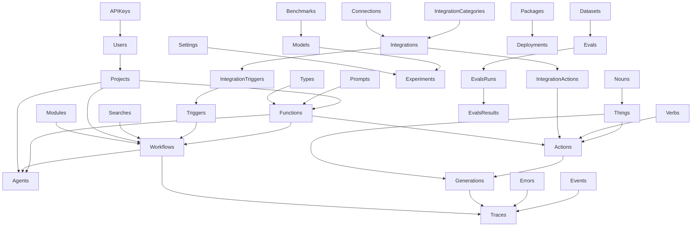
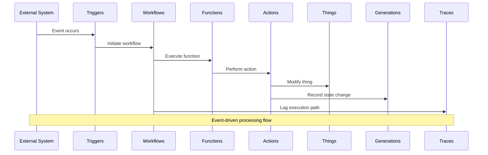
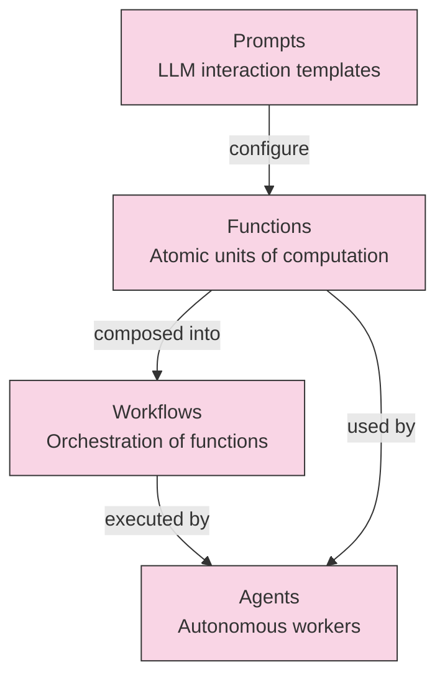
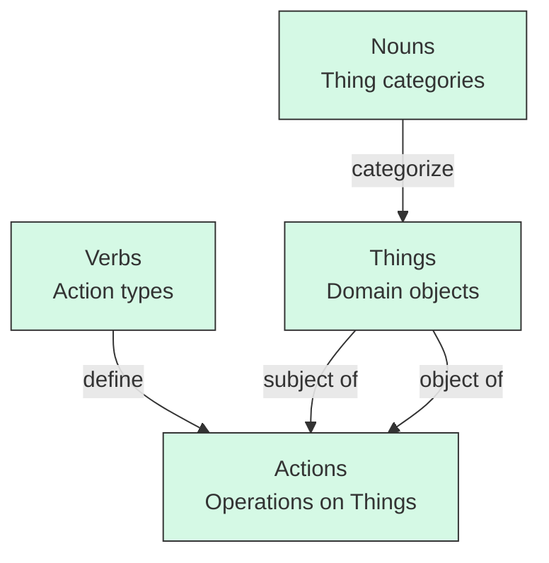
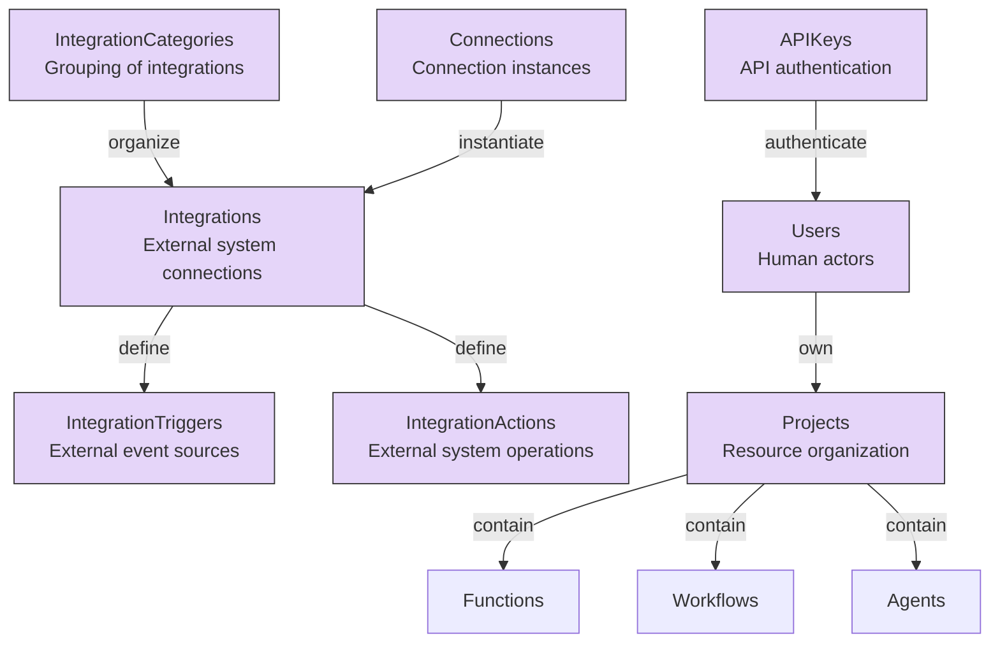

# Collections Overview

This directory contains the Payload CMS collection definitions that form the foundation of the AI Primitives platform. Collections are organized into logical groups that represent different aspects of the system and are listed below in the order they appear in the `collections` array in `index.ts`.

## Collection Groups

### AI

Collections related to AI functions, workflows, and agents - the core building blocks of the platform.

- **Functions**: Strongly-typed composable building blocks that perform specific tasks. Functions can be of various types including Object, ObjectArray, Text, TextArray, Markdown, and Code. Functions serve as the atomic units of computation in the platform.
- **Workflows**: Declarative state machines that orchestrate multiple functions. Workflows define the sequence and logic for executing functions, enabling complex operations through function composition.
- **Agents**: Autonomous digital workers that combine functions and workflows to perform complex tasks independently. Agents can make decisions, execute workflows, and interact with external systems.

### Data

Collections that define the core data model of the platform, following a subject-verb-object paradigm.

- **Nouns**: Categories or types of Things, representing entities in your business domain. Nouns provide a taxonomy for classifying Things.
- **Verbs**: Represent potential actions that can be performed, used in the Subject-Verb-Object paradigm. Verbs define the operations that can be performed on Things.
- **Things**: Physical and virtual objects in the system with properties like name, sqid, hash, type, and data. Things can be the subject or object of Actions. They represent the actual instances of Nouns in the system.

### Admin

Collections for managing users, projects, integrations, and system configuration.

- **Integrations**: Connections to external systems and services. Integrations enable the platform to interact with third-party services and APIs.
- **IntegrationCategories**: Categories for organizing integrations by functionality or domain. They provide a hierarchical structure for managing integrations.
- **IntegrationTriggers**: Event triggers from external integrations. These define when external systems can initiate workflows in the platform.
- **IntegrationActions**: Actions that can be performed on external systems. These define how the platform can interact with external systems.
- **Connections**: Specific connection instances to external systems, including authentication details and configuration.
- **Projects**: Organizational units for grouping related resources. Projects provide isolation and organization for multi-tenant deployments.
- **Users**: User accounts and authentication information. Users represent the human actors who interact with the platform.
- **Tags**: Labels for organizing and categorizing resources across the platform. Tags enable flexible metadata assignment.
- **Webhooks**: Endpoints for receiving event notifications from external systems. Webhooks allow the platform to respond to external events.
- **APIKeys**: Authentication keys for accessing the platform's APIs. APIKeys enable secure programmatic access to the platform.

### Events

Collections that handle event-driven operations in the platform.

- **Triggers**: Define conditions that initiate workflows based on events. Triggers are the entry points for event-driven processing.
- **Searches**: Query operations for retrieving data and providing context within workflows. Searches enable data retrieval and filtering.
- **Actions**: Represent operations performed on Things using the Subject-Verb-Object paradigm. Actions link a subject, verb, and object to record what happened in the system.

### Experiments

Collections for testing and iterating on AI components.

- **Experiments**: Controlled tests for measuring outcomes of different AI configurations. Experiments enable systematic testing and optimization.
- **Models**: AI model definitions and configurations. Models represent the underlying machine learning models used by functions.
- **Prompts**: Prompt templates and configurations for LLM interactions. Prompts define how to interact with language models.
- **Settings**: Configuration settings for experiments. Settings control the parameters and environment for experiments.

### Code

Collections for managing code-related resources.

- **Types**: Type definitions used across the platform. Types provide structure and validation for data.
- **Modules**: Reusable code modules that can be composed into larger systems. Modules enable code reuse and organization.
- **Packages**: Deployable packages of code that bundle multiple modules. Packages represent versioned, deployable units.
- **Deployments**: Deployment configurations and history. Deployments track where and how packages are deployed.

### Evals

Collections for evaluating and benchmarking AI components.

- **Benchmarks**: Performance benchmarks for comparing models. Benchmarks provide standardized tests for model comparison.
- **Evals**: Evaluation definitions and configurations. Evals define how to measure the performance of AI components.
- **EvalsRuns**: Execution records of evaluations. EvalsRuns track individual evaluation executions.
- **EvalsResults**: Results and metrics from evaluations. EvalsResults store the outcomes of evaluations for analysis.
- **Datasets**: Data used for training and evaluating models. Datasets provide the ground truth for evaluations.

### Observability

Collections that provide monitoring and visibility into the platform's operations.

- **Events**: Track business events throughout the system. Events provide a record of significant occurrences.
- **Errors**: Capture and store error information for debugging and analysis. Errors track failures and exceptions.
- **Generations**: Records of system state before/after an Action, including request, response, and status. Generations enable tracking of AI-generated content.
- **Traces**: Provide operational visibility into workflow execution paths. Traces enable debugging and performance analysis.

## Relationships Diagram

## Core Data Flow

## Collection Relationships by Group

### AI Components Relationships

### Data Model Relationships

### Integration and Admin Relationships

This architecture enables the creation of complex, event-driven AI applications with full observability and control. The platform's modular design allows for flexible composition of AI capabilities while maintaining strong typing and clear relationships between components.
