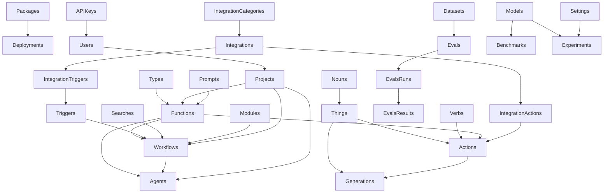

# Collections Overview

This directory contains the Payload CMS collection definitions that form the foundation of the AI Primitives platform. Collections are organized into logical groups that represent different aspects of the system.

## Collection Groups

### AI
Collections related to AI functions, workflows, and agents - the core building blocks of the platform.

- **Functions**: Strongly-typed composable building blocks that perform specific tasks. Functions can be of various types including Object, ObjectArray, Text, TextArray, Markdown, and Code.
- **Workflows**: Declarative state machines that orchestrate multiple functions. Workflows define the sequence and logic for executing functions.
- **Agents**: Autonomous digital workers that combine functions and workflows to perform complex tasks independently.

### Data
Collections that define the core data model of the platform.

- **Things**: Physical and virtual objects in the system with properties like name, sqid, hash, type, and data. Things can be the subject or object of Actions.
- **Nouns**: Categories or types of Things, representing entities in your business.
- **Verbs**: Represent potential actions that can be performed, used in the Subject-Verb-Object paradigm.

### Events
Collections that handle event-driven operations in the platform.

- **Actions**: Represent operations performed on Things using the Subject-Verb-Object paradigm. Actions link a subject, verb, and object.
- **Triggers**: Define conditions that initiate workflows based on events.
- **Searches**: Query operations for retrieving data and providing context within workflows.

### Observability
Collections that provide monitoring and visibility into the platform's operations.

- **Generations**: Records of system state before/after an Action, including request, response, and status.
- **Events**: Track business events throughout the system.
- **Errors**: Capture and store error information for debugging and analysis.
- **Traces**: Provide operational visibility into workflow execution paths.

### Admin
Collections for managing users, projects, and integrations.

- **Users**: User accounts and authentication information.
- **Projects**: Organizational units for grouping related resources.
- **APIKeys**: Authentication keys for accessing the platform's APIs.
- **Integrations**: Connections to external systems and services.
- **IntegrationCategories**: Categories for organizing integrations.
- **IntegrationTriggers**: Event triggers from external integrations.
- **IntegrationActions**: Actions that can be performed on external systems.
- **Tags**: Labels for organizing and categorizing resources.
- **Webhooks**: Endpoints for receiving event notifications.

### Code
Collections for managing code-related resources.

- **Types**: Type definitions used across the platform.
- **Modules**: Reusable code modules.
- **Packages**: Deployable packages of code.
- **Deployments**: Deployment configurations and history.

### Evals
Collections for evaluating and benchmarking AI components.

- **Evals**: Evaluation definitions and configurations.
- **EvalsRuns**: Execution records of evaluations.
- **EvalsResults**: Results and metrics from evaluations.
- **Benchmarks**: Performance benchmarks for comparing models.
- **Datasets**: Data used for training and evaluating models.

### Experiments
Collections for testing and iterating on AI components.

- **Experiments**: Controlled tests for measuring outcomes.
- **Models**: AI model definitions and configurations.
- **Prompts**: Prompt templates and configurations.
- **Settings**: Configuration settings for experiments.

## Relationships Diagram

## Core Data Flow

The platform's core data flow follows this pattern:

1. **Triggers** initiate workflows based on events
2. **Workflows** orchestrate the execution of functions
3. **Functions** perform specific tasks and generate outputs
4. **Actions** record operations performed on Things
5. **Generations** track the system state before and after Actions
6. **Traces** provide visibility into the execution path

This architecture enables the creation of complex, event-driven AI applications with full observability and control.
