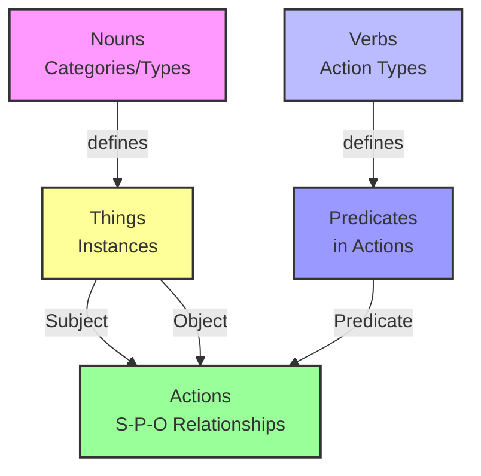

# Data Overview

The Data collection provides a simple yet powerful semantic model for representing your business domain, inspired by basic English grammar concepts that are intuitive and approachable.

## Core Data Model

Our platform is built on four fundamental concepts that work together to create a complete representation of your business domain:

- **[Nouns](/nouns)**: Categories or types of things in your system (like Customer, Product, Order)
- **[Verbs](/verbs)**: Actions that can be performed (like Create, Update, Delete)
- **[Things](/things)**: Specific instances of Nouns (a particular Customer, Product, or Order)
- **[Actions](/actions)**: Relationships between Things in Subject-Predicate-Object format

### Subject-Predicate-Object Pattern

At the heart of our data model is the natural language pattern of Subject-Predicate-Object:

```mermaid
graph LR
    A[Subject<br/>(Thing)] -->|Predicate<br/>(Verb)| B[Object<br/>(Thing)]
    style A fill:#f9f,stroke:#333,stroke-width:2px
    style B fill:#bbf,stroke:#333,stroke-width:2px
```

For example:
- "Customer purchased Product"
- "Developer deployed Application"
- "Startup acquired Funding"

Every Action in the system connects a Subject (a Thing) with an Object (another Thing) through a Predicate (a Verb), creating a semantic triple that represents a meaningful business event or relationship.



## Business Value

The Data components provide a structured foundation for your business domain, enabling you to:

- Create clear representations of your business entities and their relationships
- Define and manage the actions that can be performed within your business processes
- Model and track both physical and virtual objects that your business interacts with
- Build a comprehensive business domain model that drives your AI applications

## Integration with AI Primitives

Data components integrate seamlessly with other AI primitives:

- Use with **Functions** to transform and process business data
- Incorporate into **Workflows** to automate business processes
- Provide context for **Agents** to make intelligent decisions
- Store and retrieve from **Database** for persistent data management

## Getting Started

To get started with the Data collection, explore the following pages:

- [Nouns](/nouns) - Define and manage business entities
- [Verbs](/verbs) - Represent potential actions in your business domain
- [Things](/things) - Model physical and virtual objects
