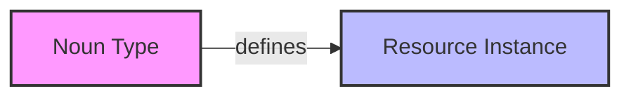

# Nouns

Nouns represent categories or types of things in your system - the fundamental building blocks of your business domain model. In English grammar terms, nouns are the "person, place, thing, or idea" that can perform actions or have actions performed on them.

## Overview

In our semantic data model, Nouns define the types or categories that your business entities fall into (like Customer, Product, Order, User, Document). They serve as templates or schemas for creating specific instances (Resources).

The Nouns collection provides a way to define, manage, and interact with these core entity types in your business applications. Nouns can be:

- Used as inputs and outputs for functions
- Referenced in workflows
- Manipulated by agents
- Stored and retrieved from databases

## In the Subject-Predicate-Object Model

In our semantic data model, Nouns play a crucial role:



For example, the Noun "Customer" defines what properties and relationships a specific customer Resource can have.

```mermaid
graph LR
    A[Customer<br/>(Noun)] -->|defines| B[ACME Corp<br/>(Resource)]
    style A fill:#f9f,stroke:#333,stroke-width:2px
    style B fill:#bbf,stroke:#333,stroke-width:2px
```

When used in Actions (Subject-Predicate-Object triples), Resources that are instances of Nouns can be either:
- The Subject performing an action (e.g., "Developer" in "Developer deployed Application")
- The Object receiving an action (e.g., "Funding" in "Startup acquired Funding")

## Key Features

- **Business Entity Types**: Define the structure for your core business objects
- **Strongly Typed**: All nouns have well-defined properties and relationships
- **Versioned**: Track changes and manage different versions of your entity definitions
- **Searchable**: Easily find and retrieve entity types based on properties
- **Extensible**: Add custom properties and methods to adapt to business needs

## Defining Nouns

Nouns can be defined using the Data.do API or through the dashboard interface.

```typescript
// Example noun definition
const Customer = {
  name: 'Customer',
  description: 'Represents a customer in the system',
  properties: {
    id: { type: 'string', required: true },
    name: { type: 'string', required: true },
    email: { type: 'string', format: 'email', required: true },
    subscriptionTier: {
      type: 'enum',
      values: ['free', 'basic', 'premium', 'enterprise'],
      default: 'free',
    },
    createdAt: { type: 'datetime', required: true },
    lastActive: { type: 'datetime' },
    preferences: { type: 'object' },
  },
  relationships: {
    orders: { type: 'hasMany', target: 'Order' },
    supportTickets: { type: 'hasMany', target: 'SupportTicket' },
  },
}
```

## Using Nouns

Nouns can be used throughout your AI applications:

```typescript
// Create a new noun instance
const newCustomer = await nouns.create('Customer', {
  name: 'Jane Doe',
  email: 'jane@example.com',
  subscriptionTier: 'premium',
  preferences: { theme: 'dark', notifications: true },
})

// Query nouns
const premiumCustomers = await nouns.find('Customer', {
  where: { subscriptionTier: 'premium' },
  include: ['orders'],
})

// Use in functions
const customerAnalysisFunction = {
  name: 'analyzeCustomerActivity',
  input: z.object({
    customer: Customer.schema,
  }),
  output: z.object({
    activityScore: z.number(),
    recommendations: z.array(z.string()),
  }),
  // Function implementation...
}
```

## Noun Templates

Discover and use pre-built noun templates from the marketplace to accelerate your development process.

## Next Steps

- [Create your first business entity](/data/nouns/create)
- [Explore industry-specific entity templates](/data/nouns/templates)
- [Learn about entity relationships](/data/nouns/relationships)
- [Implement entity-driven business models](/data/nouns/business-models)
