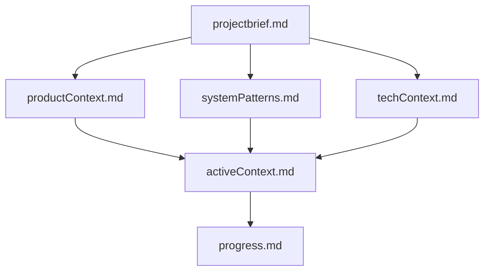

# Memory Bank

This directory contains the project's Memory Bank, a comprehensive documentation system that maintains project knowledge and context.

## Core Files

The Memory Bank consists of the following core files:

1. **[projectbrief.md](./projectbrief.md)** - Foundation document defining core requirements and goals
2. **[productContext.md](./productContext.md)** - Why the project exists, problems it solves
3. **[systemPatterns.md](./systemPatterns.md)** - System architecture, key technical decisions
4. **[techContext.md](./techContext.md)** - Technologies used, development setup
5. **[activeContext.md](./activeContext.md)** - Current work focus, recent changes
6. **[progress.md](./progress.md)** - What works, what's left to build

## File Hierarchy

The Memory Bank files build upon each other in a clear hierarchy:

## Usage

- Updates to the Memory Bank should be made when:

  1. Discovering new project patterns
  2. After implementing significant changes
  3. When context needs clarification
  4. When new decisions are made

- Focus particularly on updating `activeContext.md` and `progress.md` as they track the current state of the project.
