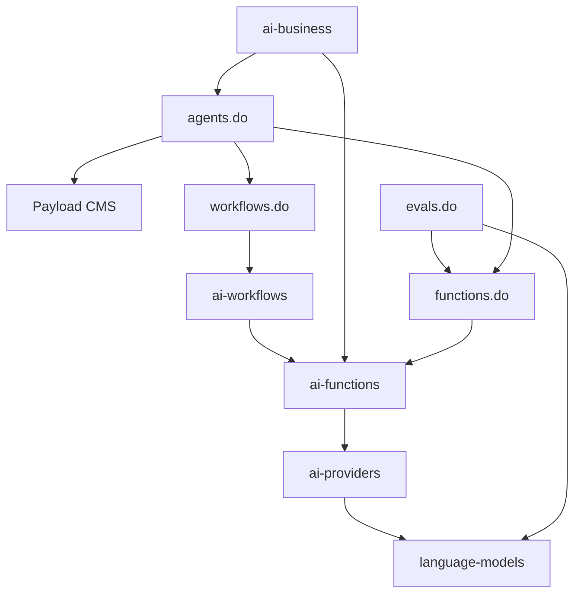

# System Patterns

## Architecture Overview

Drivly AI is structured as a monorepo with multiple packages that work together to provide a comprehensive AI development ecosystem. The architecture follows a modular approach with clearly defined boundaries between components, allowing them to be used independently or together. The system uses TypeScript throughout for type safety and leverages modern JavaScript features for a developer-friendly experience.

## Key Technical Decisions

- Monorepo structure using pnpm workspaces for managing multiple packages
- TypeScript for type safety and developer experience
- Next.js for web applications and API routes
- Provider-agnostic abstractions for language models
- Schema-based validation for AI function outputs
- Template literals for intuitive AI prompting
- Modular design allowing packages to be used independently
- Open source MIT license for core packages

## Design Patterns

- Proxy-based API for dynamic function generation
- Adapter pattern for supporting multiple AI providers
- Factory pattern for creating AI models based on capabilities
- Strategy pattern for model selection
- Observer pattern for event-based workflows
- Builder pattern for constructing complex AI prompts
- Repository pattern for data access abstraction

## Component Relationships

## Data Flow

The system typically processes data by:

1. User code interacts with high-level SDKs (functions.do, workflows.do, etc.)
2. These SDKs use the core packages (ai-functions, ai-workflows, etc.)
3. AI requests are routed through ai-providers to the appropriate language model
4. Results are validated against schemas and returned as structured data
5. Applications can store and retrieve data using ai-database
6. Workflows can orchestrate complex sequences of operations

## Security Considerations

- API keys for AI providers are handled securely
- Authentication for user accounts and API access
- Data validation to prevent prompt injection
- Rate limiting for API endpoints
- Role-based access control for admin functions
- Secure handling of sensitive business data

## Performance Optimizations

- Lazy loading of AI models and providers
- Caching of common AI operations
- Streaming responses for long-running operations
- Parallel processing of independent AI tasks
- Edge function compatibility for low-latency requests
- Optimized prompts to reduce token usage
- Vector embeddings for efficient similarity searches
