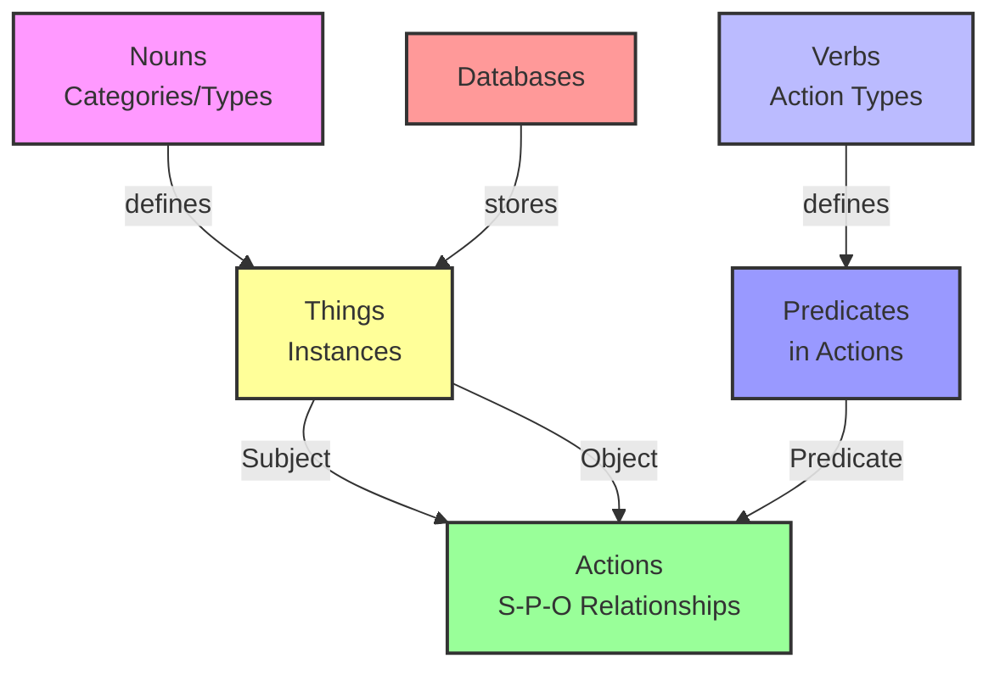

# [database.do](https://database.do)

[](https://www.npmjs.org/package/database.do)
[](https://npmjs.org/package/database.do)
[](https://github.com/drivly/ai/blob/main/LICENSE)
[](https://www.typescriptlang.org/)
[](https://discord.gg/tafnNeUQdm)
[](https://github.com/drivly/ai/issues)
[](https://github.com/drivly/ai)

> AI-Native Data Access SDK for seamless database operations with MongoDB, PostgreSQL, and SQLite

`database.do` is a powerful SDK that simplifies database operations with an intuitive API. It provides a seamless interface for managing collections and performing CRUD operations with built-in AI capabilities, all while maintaining zero dependencies except for `apis.do`.

## Features

- **Simple, Intuitive API** - Clean and straightforward methods for database operations
- **Flexible Schema Support** - Works with both schema-less and defined schema types
- **AI-Native** - Built with AI-first principles for intelligent data operations
- **Multiple Database Support** - Works with MongoDB, PostgreSQL, and SQLite
- **Admin UI Included** - Automatic admin interface for managing your data
- **REST API** - Full List + CRUD operations available through a REST API
- **Type Safety** - Full TypeScript support with strongly-typed interfaces
- **Advanced Querying** - Powerful filtering, sorting, and pagination capabilities
- **Authentication & Authorization** - Built-in security features
- **Zero Dependencies** - Only depends on `apis.do` for API communication
- **Lightweight** - Minimal footprint for both browser and Node.js environments

## Installation

```bash
# Using npm
npm install database.do

# Using yarn
yarn add database.do

# Using pnpm
pnpm add database.do
```

## Quick Start

```typescript
import { db } from 'database.do'

// Create a new post
const post = await db.posts.create({
  title: 'Getting Started with database.do',
  content: 'This is a sample post created with database.do SDK',
  status: 'Published',
  contentType: 'Markdown',
  tags: ['database', 'tutorial'],
  author: 'author123',
})

// Query posts with filtering
const publishedPosts = await db.posts.find({
  where: {
    status: 'Published',
    author: 'author123',
  },
})

// Get a post by ID
const singlePost = await db.posts.findOne(post.id)

// Update a post
await db.posts.update(post.id, {
  title: 'Updated Title',
})

// Delete a post
await db.posts.delete(post.id)
```

> Note: You'll need to set the `DATABASE_API_KEY` environment variable for authenticated requests.

## Usage Examples

### Configuration Options

You can customize the database client with additional configuration options:

```typescript
import { DB } from 'database.do'

// Initialize with custom configuration
const db = DB({
  baseUrl: 'https://your-custom-instance.database.do', // Optional, defaults to https://database.do
  apiKey: 'YOUR_API_KEY_HERE', // Optional, overrides the DATABASE_API_KEY environment variable
})

// Create a product
const product = await db.products.create({
  name: 'Smart Speaker',
  description: 'Voice-controlled smart speaker with AI assistant',
  price: 99.99,
  category: 'electronics',
  tags: ['smart-home', 'audio', 'voice-control'],
  isAvailable: true,
  dimensions: {
    height: 15,
    width: 10,
    depth: 10,
  },
  features: ['voice-control', 'multi-room-audio', 'smart-home-integration'],
})
```

### Schema Definition

You can define your database schema directly in your code:

```typescript
import { DB } from 'database.do'

const db = DB({
  posts: {
    title: 'text',
    content: 'richtext',
    status: 'Draft | Published | Archived', // Select field with predefined options
    contentType: 'Text | Markdown | Code | Object | Schema', // Another select field example
    tags: 'tags[]',
    author: 'authors',
  },
  tags: {
    name: 'text',
    posts: '<-posts.tags', // Join field to posts (reverse relation)
  },
  authors: {
    name: 'text',
    email: 'email',
    role: 'Admin | Editor | Writer', // Select field with predefined options
    posts: '<-posts.author', // Join field to posts (reverse relation)
  },
})

// Create documents that conform to your defined schema
// The server will validate the data against your schema
const post = await db.posts.create({
  title: 'Working with Schemas',
  content: 'This post demonstrates schema validation and relationships',
  status: 'Published',
  contentType: 'Markdown',
  tags: ['database', 'schema'],
  author: 'author123',
})
```

### Advanced Querying

```typescript
import { db } from 'database.do'

// Find products with pagination and sorting
const products = await db.products.find({
  where: {
    price: { gt: 100 },
    isAvailable: true,
    category: 'electronics',
  },
  limit: 10,
  page: 1,
  sort: 'price:desc',
})

// Find with complex filters
const results = await db.posts.find({
  where: {
    $or: [{ status: 'Published' }, { author: 'author123' }],
    $and: [{ createdAt: { gt: new Date('2023-01-01').toISOString() } }, { tags: { contains: 'featured' } }],
  },
})

// Search functionality
const searchResults = await db.products.search('smart speaker', {
  limit: 20,
  sort: 'relevance:desc',
})
```

### Working with Related Data

```typescript
import { db } from 'database.do'

// Get posts with related data
const posts = await db.posts.find({
  populate: ['author', 'tags'],
})

// Get a single order with customer data
const order = await db.orders.findOne('order123')
const customer = await db.customers.findOne(order.customer)

// Get all orders for a customer
const customerOrders = await db.orders.find({
  where: {
    customer: customer.id,
  },
})
```

## API Reference

### DB Configuration

Initialize the database client with optional configuration:

```typescript
import { DB } from 'database.do'

const db = DB({
  baseUrl?: string, // Optional, defaults to 'https://database.do'
  apiKey?: string,  // Optional, overrides the DATABASE_API_KEY environment variable
  // Optional schema definitions
  collection1: { /* schema */ },
  collection2: { /* schema */ },
})
```

### Collection Methods

#### db.{collection}.find(options?)

Retrieves multiple documents from a collection with optional filtering, sorting, and pagination.

```typescript
interface QueryOptions {
  where?: Record<string, any> // Filter criteria
  sort?: string | string[] // Sorting options
  limit?: number // Number of results per page
  page?: number // Page number
  select?: string | string[] // Fields to include
  populate?: string | string[] // Relations to populate
}

const results = await db.posts.find(options)
```

#### db.{collection}.findOne(id)

Retrieves a single document by its ID.

```typescript
const document = await db.posts.findOne('document-id')
```

#### db.{collection}.create(data)

Creates a new document in the collection.

```typescript
const newDocument = await db.posts.create({
  field1: 'value1',
  field2: 'value2',
  // ...
})
```

#### db.{collection}.update(id, data)

Updates an existing document by its ID.

```typescript
const updatedDocument = await db.posts.update('document-id', {
  field1: 'new value',
  // ...
})
```

#### db.{collection}.delete(id)

Deletes a document by its ID.

```typescript
await db.posts.delete('document-id')
```

#### db.{collection}.search(query, options?)

Performs a text search across documents in a collection.

```typescript
const searchResults = await db.posts.search('search term', {
  limit: 20,
  sort: 'relevance:desc',
})
```

## Schema Support

`database.do` offers two approaches to working with data:

### Schema-less Mode

In schema-less mode, you can:

- Create collections and documents on-the-fly
- Add any fields to your documents without constraints
- Evolve your data model organically as your application grows
- Store JSON documents with nested objects and arrays
- Avoid upfront schema design when requirements are fluid

```typescript
import { db } from 'database.do'

// Use any collection name and any fields
const product = await db.products.create({
  name: 'Smart Speaker',
  price: 99.99,
  // Any fields are allowed
})
```

### Defined Schema Mode

With defined schemas, you gain:

- Data validation against your schema
- Relationship management between collections
- Type safety with TypeScript interfaces generated from your schema
- Admin UI fields customized to your schema
- API endpoints that respect your schema constraints
- Improved data consistency and integrity

```typescript
import { DB } from 'database.do'

// Define your schema
const db = DB({
  products: {
    name: 'text',
    price: 'number',
    description: 'richtext',
    category: 'categories', // Reference to another collection
  },
  categories: {
    name: 'text',
    products: '<-products.category', // Reverse relation
  },
})
```

You can define schemas through code as shown above, or through the database.do admin interface or API, and then use the SDK to interact with your data according to those schemas.

## Implementation Details

Behind the scenes, `database.do` uses [Payload CMS](https://payloadcms.com) to provide a powerful database solution:

- **MongoDB** support via Mongoose
- **PostgreSQL** and **SQLite** support via Drizzle ORM
- Automatic Admin UI generation
- REST API with full List + CRUD operations
- Authentication and authorization
- Media handling
- Webhooks and more

The SDK itself is designed to be lightweight with zero dependencies except for `apis.do`, making it suitable for both browser and Node.js environments. It communicates with the database.do service through a RESTful API, abstracting away the complexity of direct database interactions.

## Core Data Model

`database.do` is built on a semantic data model inspired by basic English grammar, making it intuitive and approachable:

- **Nouns** - Categories or types of things in your system (like Customer, Product, Order)
- **Verbs** - Actions that can be performed (like Create, Update, Delete)
- **Things** - Specific instances of Nouns (a particular Customer, Product, or Order)
- **Actions** - Relationships between Things in Subject-Predicate-Object format
- **Databases** - Configurations for database storage (Integrated, Dedicated, or Self-Hosted)

### Database Configuration

You can configure different types of databases for your application:

- **Integrated** - Uses the platform's integrated collections with flexible or enforced schema
- **Dedicated** - Dedicated database instances (MongoDB, PostgreSQL, or SQLite) in specific AWS regions
- **Self-Hosted** - Self-managed database instances (MongoDB, PostgreSQL, or SQLite) with your own configuration

These database configurations determine how your data is stored, accessed, and managed within the platform.

### Subject-Predicate-Object Pattern

At the heart of our data model is the natural language pattern of Subject-Predicate-Object:

```mermaid
graph LR
    A[Subject<br/>(Thing)] -->|Predicate<br/>(Verb)| B[Object<br/>(Thing)]
    style A fill:#f9f,stroke:#333,stroke-width:2px
    style B fill:#bbf,stroke:#333,stroke-width:2px
```

The complete data model relationship can be visualized as:



For example:
- "Customer purchased Product"
- "Developer deployed Application"
- "Startup acquired Funding"

This simple but powerful model allows you to represent complex business relationships and events in an intuitive, language-based format.

### Working with the Core Data Model

```typescript
import { db } from 'database.do'

// Create Noun types (categories)
const customerNoun = await db.nouns.create({
  name: 'Customer',
  description: 'A business or individual that purchases products or services',
})

const productNoun = await db.nouns.create({
  name: 'Product',
  description: 'A software offering available for purchase',
})

// Create Verb types (actions)
const purchaseVerb = await db.verbs.create({
  action: 'Purchase',
  description: 'The act of buying a product or service',
})

// Create Things (instances of Nouns)
const startupCustomer = await db.things.create({
  name: 'TechStartup Inc.',
  type: customerNoun.id,
  data: {
    email: 'contact@techstartup.com',
    plan: 'enterprise',
    employees: 42,
    industry: 'SaaS',
  },
})

const saasProduct = await db.things.create({
  name: 'AI Analytics Platform',
  type: productNoun.id,
  data: {
    price: 499.99,
    billingCycle: 'monthly',
    features: ['predictive-analytics', 'custom-dashboards', 'api-access'],
  },
})

// Create an Action (Subject-Predicate-Object relationship)
const purchaseAction = await db.actions.create({
  subject: startupCustomer.id,  // The customer (Subject)
  verb: purchaseVerb.id,        // The purchase action (Predicate)
  object: saasProduct.id,       // The product (Object)
  metadata: {
    timestamp: new Date(),
    amount: 499.99,
    paymentMethod: 'credit_card',
  },
})

// Query all purchases by this customer
const customerPurchases = await db.actions.find({
  where: {
    subject: startupCustomer.id,
    verb: purchaseVerb.id,
  },
  include: ['object', 'metadata'],
})
```

## Related Projects

- [functions.do](https://functions.do) - Typesafe AI Functions
- [workflows.do](https://workflows.do) - Business Process Automation
- [agents.do](https://agents.do) - Autonomous Digital Workers
- [apis.do](https://apis.do) - Clickable Developer Experiences
- [models.do](https://models.do) - AI Model Management
- [llm.do](https://llm.do) - Large Language Model Gateway

## Environment Compatibility

`database.do` is designed to work seamlessly in various JavaScript environments:

- **Browser** - Works in modern browsers without polyfills
- **Node.js** - Compatible with Node.js 18+ using native fetch
- **Edge Functions** - Optimized for serverless and edge environments
- **React Native** - Works with React Native applications

## License

MIT © [Drivly](https://driv.ly)
